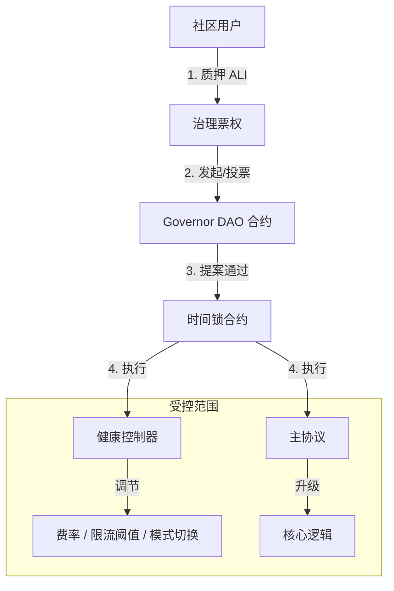

# 代币经济与自治治理模型设计 (Tokenomics & DAO)

本文档旨在为 Aliana 协议设计一套基于 **ALI Token** 的激励与治理闭环系统。该系统将协议的 USDT 现金流价值与 ALI 的治理权深度绑定，实现从“单中心化管理”向“社区自治（DAO）”的平滑过渡。

---

## 1. 设计目标

1.  **行为激励 (Incentive)**：通过 Token 奖励高价值用户行为（大额入金、长期复投、社区推广），降低单纯依赖 USDT 高收益的资金压力。
2.  **价值捕获 (Value Capture)**：Token 必须具有真实的使用场景和价值支撑（如手续费分红、收益加速）。
3.  **自治闭环 (Autonomous Loop)**：将《健康监控自动调节系统》中的 `HealthController` 权限逐步移交给 Token 持有者，实现真正的去中心化调节。

---

## 2. 代币模型 (Tokenomics)

### 2.1 基础信息
*   **名称**: Aliana Governance Token
*   **符号**: **ALI**
*   **标准**: ERC-20 (含 ERC20Votes 扩展，支持链上投票)
*   **初始总量**: 100,000,000 (1亿枚)
*   **增发/通缩**: 设定硬顶，并通过协议收入回购销毁实现通缩。

### 2.2 分配方案 (建议)
| 分配对象 | 比例 | 说明 | 解锁规则 |
|---|---|---|---|
| **社区挖矿 (Mining)** | 60% | 奖励入金、复投、做市 | 随业务行为线性产出，无预挖 |
| **DAO 财库 (Treasury)** | 20% | 生态建设、备付金、活动 | 初始解锁 10%，剩余按月线性解锁 |
| **团队 (Team)** | 10% | 核心开发与运营 | 锁仓 6 个月，之后分 24 个月线性解锁 |
| **早期贡献者 (Early)** | 5% | 种子用户、KOL | 上线即解锁，或分批释放 |
| **流动性 (Liquidity)** | 5% | DEX 初始池 (ALI/USDT) | 永久锁仓或由协议控制 |

### 2.3 产出机制：贡献即挖矿 (Proof of Contribution)

不再采用单纯的“时间挖矿”，而是基于**对协议资金池的贡献度**进行加权产出。

#### A. 入金挖矿 (Deposit Mining)
*   **逻辑**：用户每存入 `makeDeposit` 100 USDT，获得 $N$ 个 ALI。
*   **权重**：1.0x。
*   **公式**：`MintAmount = DepositAmount * MiningRate`

#### B. 复投挖矿 (Compound Mining) - **核心激励点**
*   **逻辑**：鼓励用户延迟满足，复投不仅增加 USDT 本金，还能获得比直接入金更多的 ALI。
*   **权重**：**1.5x ~ 2.0x**。
*   **目的**：提高资金留存率，延缓挤兑风险。

#### C. 邀请挖矿 (Referral Mining)
*   **逻辑**：上级获得下级挖矿产出的 **5% ~ 10%**（额外铸造，不扣除下级收益）。
*   **限制**：需满足 `TIER_DEPOSIT_THRESHOLDS` 中的一定等级才能开启此权益。

---

## 3. 代币效用与价值捕获 (Utility)

### 3.1 协议费分红 (Staking for Yield)
目前协议收取 5% (`ADMIN_FEE_PERCENT`) 的管理费。在代币模型引入后，建议调整分配结构：
*   **3%**：继续流向 `TREASURY_WALLET`（团队运营成本）。
*   **1%**：流向 `ReserveVault`（作为《健康监控系统》的备付金）。
*   **1%**：**回购并分配给 ALI 质押者**。
    *   *机制*：智能合约定期将这 1% 的 USDT 在 DEX 换成 ALI，然后分发给 `AliStaking` 池的质押者。

### 3.2 收益加速 (ROI Boost)
持有并质押 ALI 可以提升 USDT 的基础日化收益率（Tier Boost）。
*   *现状*：`TIER_DAILY_ROI_PERCENTS` 依赖入金金额（如 5000 USDT 才能达到最高档）。
*   *新规*：质押 10,000 ALI 可**视同**存入了 1,000 USDT 的等级权重。
*   *价值*：让小资金用户通过持有 Token 也能享受大户的收益率，增加 Token 买盘。

### 3.3 治理投票 (Governance)
只有质押 ALI 生成的 **vALI** 才拥有投票权，用于决定协议生死攸关的参数（详见下节）。

---

## 4. 自治治理架构 (Autonomous Governance)

为了实现“可自治的模型”，我们需要用代码替代“管理员私钥”。

### 4.1 治理架构图



### 4.2 治理权限范围
DAO 可以通过提案修改以下内容：

1.  **健康系统参数**：
    *   调整 `adminFeeBps`（管理费率）。
    *   调整 `minWithdrawAmount`（最小提现额）。
    *   调整 `maxDailyWithdrawPerUser`（限流阈值）。
2.  **模式切换**：
    *   投票决定是否进入 `Stabilize`（去杠杆）或 `Emergency`（紧急）模式。
    *   *注*：紧急模式通常允许“多签委员会”快速开启，但“解除”必须经过 DAO 投票。
3.  **财库分配**：
    *   决定 `ReserveVault` 中的资金何时释放、释放多少用于偿付用户。

### 4.3 治理流程 (Lifecycle)
1.  **提案 (Propose)**：持有 > 1% 总量的 vALI 用户发起提案（例如：“将管理费从 5% 降至 4%”）。
2.  **投票 (Vote)**：3 天投票期，需满足法定人数（Quorum，如 4% 总量）。
3.  **公示 (Queue)**：通过后进入 24 小时时间锁（Timelock），给用户反应时间。
4.  **执行 (Execute)**：时间锁结束后，任何人可触发执行，链上参数自动变更。

---

## 5. 链上实施建议

### 5.1 新增合约模块
1.  **`AlianaToken.sol`**：
    *   基于 `ERC20Votes`，支持快照投票。
    *   包含 `mint` 权限控制（仅限 `MiningController`）。
2.  **`MiningController.sol`**：
    *   管理挖矿速率、减产周期。
    *   计算用户应得 Token。
3.  **`AliStaking.sol`**：
    *   用户质押 ALI，领取 USDT 分红（来自回购）。
    *   提供 `getBoostMultiplier(user)` 接口给主协议查询等级加成。

### 5.2 主协议改造 (`AlianaProtocol.sol`)
需要增加钩子函数以支持“挖矿”和“等级加成”：

```solidity
// 1. 挖矿钩子
function makeDeposit(...) {
    // ... 原有逻辑 ...
    if (miningController != address(0)) {
        miningController.notifyDeposit(msg.sender, amount); // 触发挖矿
    }
}

function compoundDailyRewards(...) {
    // ... 原有逻辑 ...
    if (miningController != address(0)) {
        miningController.notifyCompound(msg.sender, amount); // 触发高权重挖矿
    }
}

// 2. 等级加成读取
function _getTierIndex(uint256 amount) internal view returns (uint256) {
    uint256 effectiveAmount = amount;
    // 叠加 Token 质押带来的虚拟额度
    if (aliStaking != address(0)) {
        effectiveAmount += aliStaking.getBoostAmount(msg.sender);
    }
    // ... 原有等级判断逻辑 ...
}
```

---

## 6. 总结

该模型通过引入 **ALI Token**，解决了三个核心问题：
1.  **资金健康**：通过复投挖矿加权，引导用户减少提现。
2.  **用户留存**：通过 Token 质押加成（ROI Boost），让用户长期锁定 Token 和 USDT。
3.  **去中心化信任**：通过 DAO 接管 `HealthController`，消除用户对“管理员权限”的顾虑，实现真正的代码自治。
